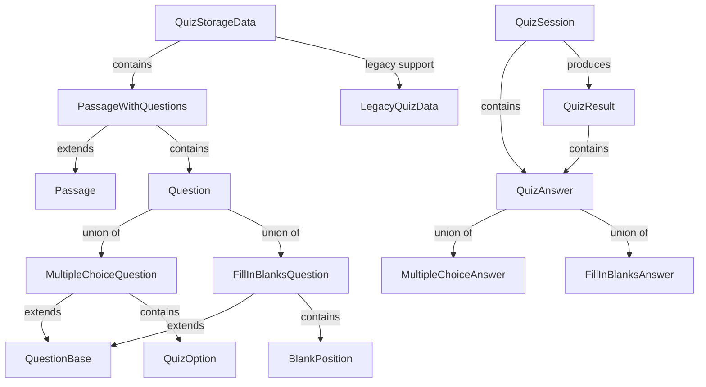

# 📚 Database Schema Documentation

## 🎯 Overview
The project now uses a **unified database schema** (`database-schema.json`) that matches TypeScript interfaces exactly, replacing the previous dual-schema system.

- **Schema File**: `/src/data/schemas/database-schema.json`
- **Purpose**: Complete validation for all quiz-related data structures
- **Version**: 2.0.0

---

## 📊 Schema Architecture

The `database-schema.json` contains comprehensive definitions organized into logical groups:

### Core Components
- **Question Types**: Multiple Choice, Fill-in-Blanks
- **Content Structure**: Passages, Questions, Options
- **User Interaction**: Sessions, Answers, Results
- **Legacy Support**: Backwards compatibility definitions

---

## 📝 Schema Definitions Explained

### 1. QuizOption
**Purpose**: Defines a single option in multiple-choice questions
```json
{
  "id": "A",           // Option identifier (A, B, C, D)
  "label": "A)",       // Display label for UI
  "text": "Answer text" // Option content
}
```
**Used in**: MultipleChoiceQuestion
**Validation Rules**:
- `id`: Pattern `^[A-Z]$|^[A-Z][0-9]?$` (e.g., "A", "B1")
- `label`: Max 5 characters
- `text`: Required, min 1 character

---

### 2. BlankPosition
**Purpose**: Defines position and details of blanks in fill-in-blanks questions
```json
{
  "id": "blank-1",        // Unique blank identifier
  "startIndex": 10,       // Start position in text
  "endIndex": 15,         // End position in text
  "placeholder": "verb",  // Hint for user (optional)
  "maxLength": 20,        // Max input length (optional)
  "correctAnswer": "went" // Correct answer for validation
}
```
**Used in**: FillInBlanksQuestion
**Validation Rules**:
- `startIndex`, `endIndex`: Must be >= 0
- `maxLength`: Must be >= 1 if provided

---

### 3. QuestionBase
**Purpose**: Base properties shared by all question types
```json
{
  "id": "q-123",
  "type": "multiple-choice",  // or "fill-in-blanks"
  "title": "Question 1",
  "instruction": "Choose the correct answer",
  "passageId": "passage-1",
  "orderIndex": 0
}
```
**Extended by**: MultipleChoiceQuestion, FillInBlanksQuestion
**Key Properties**:
- `type`: Enum ["multiple-choice", "fill-in-blanks"]
- `passageId`: Links question to parent passage
- `orderIndex`: Controls display order

---

### 4. MultipleChoiceQuestion
**Purpose**: Complete multiple-choice question structure
```json
{
  "id": "mc-1",
  "type": "multiple-choice",
  "title": "Choose the correct option",
  "options": [
    {"id": "A", "label": "A)", "text": "Option 1"},
    {"id": "B", "label": "B)", "text": "Option 2"}
  ],
  "maxSelections": 1,        // Single or multiple choice
  "correctAnswers": ["A"]     // Array of correct option IDs
}
```
**Validation Rules**:
- `options`: Min 2, max 10 items
- `maxSelections`: Default 1, min 1
- Extends QuestionBase

---

### 5. FillInBlanksQuestion
**Purpose**: Complete fill-in-blanks question structure
```json
{
  "id": "fib-1",
  "type": "fill-in-blanks",
  "title": "Complete the sentence",
  "text": "The cat ___ on the mat",
  "blanks": [
    {
      "id": "blank-1",
      "startIndex": 8,
      "endIndex": 11,
      "correctAnswer": "sat"
    }
  ]
}
```
**Validation Rules**:
- `blanks`: Min 1 item
- Text must contain placeholder markers
- Extends QuestionBase

---

### 6. Question (Union Type)
**Purpose**: Union of all question types
```typescript
Question = MultipleChoiceQuestion | FillInBlanksQuestion
```
**Usage**: When handling arrays of mixed question types

---

### 7. Passage
**Purpose**: Reading/listening passage without questions
```json
{
  "id": "passage-1",
  "title": "Climate Change Effects",
  "content": "Full passage text here...",
  "category": "reading",  // IELTS skill type
  "tags": ["environment", "science"],
  "estimatedTime": 20     // Minutes
}
```
**Categories**: reading, listening, writing, speaking
**Used as base for**: PassageWithQuestions

---

### 8. PassageWithQuestions
**Purpose**: Complete passage with associated questions
```json
{
  "id": "passage-1",
  "title": "Climate Change",
  "content": "Passage text...",
  "category": "reading",
  "questions": [
    // Array of Question objects (mixed types)
  ]
}
```
**Key Structure**: Main content unit for quizzes
**Extends**: Passage + questions array

---

### 9. MultipleChoiceAnswer
**Purpose**: User's answer to multiple-choice question
```json
{
  "questionId": "mc-1",
  "type": "multiple-choice",
  "selectedOptions": ["A", "C"],  // User selections
  "timeSpent": 45,                // Seconds
  "isCorrect": true,               // Validation result
  "timestamp": 1234567890          // Unix timestamp
}
```
**Tracking**: Response accuracy and time metrics

---

### 10. FillInBlanksAnswer
**Purpose**: User's answer to fill-in-blanks question
```json
{
  "questionId": "fib-1",
  "type": "fill-in-blanks",
  "answers": {
    "blank-1": "went",      // User input per blank
    "blank-2": "quickly"
  },
  "timeSpent": 60,
  "correctCount": 1,        // Number of correct blanks
  "totalBlanks": 2,
  "timestamp": 1234567890
}
```
**Validation**: Per-blank accuracy tracking

---

### 11. QuizAnswer (Union Type)
**Purpose**: Union of all answer types
```typescript
QuizAnswer = MultipleChoiceAnswer | FillInBlanksAnswer
```
**Usage**: Polymorphic answer handling

---

### 12. QuizSession
**Purpose**: Tracks user's quiz session
```json
{
  "id": "session-123",
  "startTime": "2024-01-01T10:00:00Z",
  "endTime": "2024-01-01T10:30:00Z",
  "answers": [...],              // Array of QuizAnswer
  "currentQuestionIndex": 5,
  "status": "in-progress",
  "totalTimeSpent": 1800,        // Seconds
  "score": 7,
  "maxScore": 10
}
```
**Status Values**: 
- `not-started`: Initial state
- `in-progress`: Active session
- `completed`: Finished normally
- `paused`: Temporarily stopped
- `abandoned`: Left incomplete

---

### 13. QuizResult
**Purpose**: Final quiz result after completion
```json
{
  "sessionId": "session-123",
  "quizId": "quiz-1",
  "score": 8,
  "maxScore": 10,
  "percentage": 80,
  "correctAnswers": 8,
  "totalQuestions": 10,
  "timeSpent": 1800,
  "answers": [...],          // Complete answer history
  "completedAt": "2024-01-01T10:30:00Z"
}
```
**Analytics**: Complete performance metrics

---

### 14. QuizStorageData
**Purpose**: Root storage structure for all quiz data
```json
{
  "passages": [...],         // Array of PassageWithQuestions
  "legacyQuizzes": [...],    // Backwards compatibility
  "version": "2.0.0"         // Schema version (semver)
}
```
**Primary Storage**: Main data container
**Version Pattern**: `^\d+\.\d+\.\d+$` (semantic versioning)

---

### 15. LegacyQuizData
**Purpose**: Supports old quiz format for migration
- Union of `MultipleChoiceData` and `FillInBlanksData`
- Maintains compatibility with existing data
- **Migration Path**: Should be gradually converted to new format

**Legacy Structure Features**:
- Inline passage content (string or object)
- Flat structure without passage references
- Direct question-level metadata

---

## 🔄 Validation Functions

### Core Validation Functions
```typescript
// Validate individual components
validateQuestion(question)              // Any question type
validatePassageWithQuestions(passage)   // Passage + questions
validateQuizStorageData(data)          // Root storage
validateQuizSession(session)           // Active session
validateQuizResult(result)             // Final results
validateQuizAnswer(answer)             // User answers

// Backwards compatibility
validateLegacyQuizData(data)           // Old format
validateQuizSet(data)                  // Alias for legacy
```

### Usage Examples

#### Validate Question Creation
```typescript
// Real-time validation during editing
const question = {
  id: "new-q",
  type: "multiple-choice",
  title: "Select the correct answer",
  options: [...],
  correctAnswers: ["A"]
};

const result = validateQuestion(question);
if (!result.valid) {
  console.error(result.formattedErrors);
}
```

#### Validate Complete Quiz Storage
```typescript
// Before saving to database
const quizData = {
  passages: [
    {
      id: "p1",
      title: "Reading Passage",
      content: "...",
      questions: [...]
    }
  ],
  version: "2.0.0"
};

const result = validateQuizStorageData(quizData);
if (result.valid) {
  await saveToDatabase(quizData);
}
```

#### Track User Session
```typescript
// During quiz attempt
const session = {
  id: generateId(),
  startTime: new Date().toISOString(),
  answers: [],
  currentQuestionIndex: 0,
  status: "in-progress",
  totalTimeSpent: 0
};

const result = validateQuizSession(session);
if (result.valid) {
  await sessionStorage.save(session);
}
```

---

## 🏗️ Migration Strategy

### From Old to New Schema

#### Step 1: Identify Legacy Data
```typescript
function isLegacyFormat(data: any): boolean {
  // Legacy format has questions at root level
  return data.questions && !data.passages;
}
```

#### Step 2: Transform Legacy to New
```typescript
function migrateLegacyToNew(legacy: LegacyQuizData): QuizStorageData {
  return {
    passages: [{
      id: legacy.id,
      title: legacy.title || "Untitled",
      content: typeof legacy.passage === 'string' 
        ? legacy.passage 
        : legacy.passage?.content || "",
      category: legacy.category || "reading",
      questions: legacy.questions || []
    }],
    version: "2.0.0"
  };
}
```

#### Step 3: Validate and Save
```typescript
async function migrateQuiz(legacyData: any) {
  // Validate as legacy
  if (validateLegacyQuizData(legacyData).valid) {
    // Transform
    const newFormat = migrateLegacyToNew(legacyData);
    
    // Validate new format
    if (validateQuizStorageData(newFormat).valid) {
      await saveNewFormat(newFormat);
      return { success: true };
    }
  }
  return { success: false };
}
```

---

## 📊 Schema Relationships



---

## 🚀 Best Practices

### 1. Always Validate at Boundaries
```typescript
// API endpoint
export async function POST(request: Request) {
  const data = await request.json();
  
  // Validate immediately
  const validation = validateQuizStorageData(data);
  if (!validation.valid) {
    return Response.json({
      error: "Invalid data",
      details: validation.formattedErrors
    }, { status: 400 });
  }
  
  // Safe to process
  return processQuiz(data);
}
```

### 2. Use Specific Validators
```typescript
// ✅ Good - Specific validation
validateQuestion(questionData);
validatePassageWithQuestions(passageData);

// ❌ Bad - Generic validation
validateAny(data);
```

### 3. Handle Union Types Properly
```typescript
function processAnswer(answer: QuizAnswer) {
  if (answer.type === "multiple-choice") {
    // TypeScript knows this is MultipleChoiceAnswer
    handleMultipleChoice(answer.selectedOptions);
  } else if (answer.type === "fill-in-blanks") {
    // TypeScript knows this is FillInBlanksAnswer
    handleFillInBlanks(answer.answers);
  }
}
```

---

## 📝 Common Validation Scenarios

### Scenario 1: Question Bank Import
```typescript
async function importQuestionBank(questions: unknown[]) {
  const results = questions.map(q => {
    const validation = validateQuestion(q);
    return {
      question: q,
      valid: validation.valid,
      errors: validation.formattedErrors
    };
  });
  
  const validQuestions = results
    .filter(r => r.valid)
    .map(r => r.question);
  
  return {
    imported: validQuestions.length,
    failed: results.length - validQuestions.length,
    errors: results.filter(r => !r.valid)
  };
}
```

### Scenario 2: Live Session Tracking
```typescript
function QuizSession() {
  const [session, setSession] = useState<QuizSession>();
  
  const updateAnswer = (answer: QuizAnswer) => {
    // Validate answer
    if (!validateQuizAnswer(answer).valid) {
      return { error: "Invalid answer format" };
    }
    
    // Update session
    const newSession = {
      ...session,
      answers: [...session.answers, answer],
      currentQuestionIndex: session.currentQuestionIndex + 1
    };
    
    // Validate session
    if (validateQuizSession(newSession).valid) {
      setSession(newSession);
      saveSession(newSession);
    }
  };
}
```

### Scenario 3: Results Calculation
```typescript
async function calculateResults(sessionId: string): Promise<QuizResult> {
  const session = await loadSession(sessionId);
  
  const result: QuizResult = {
    sessionId,
    quizId: session.quizId,
    score: calculateScore(session.answers),
    maxScore: session.questions.length,
    percentage: (score / maxScore) * 100,
    correctAnswers: countCorrect(session.answers),
    totalQuestions: session.questions.length,
    timeSpent: session.totalTimeSpent,
    answers: session.answers,
    completedAt: new Date().toISOString()
  };
  
  // Validate before saving
  const validation = validateQuizResult(result);
  if (!validation.valid) {
    throw new Error(`Invalid result: ${validation.formattedErrors}`);
  }
  
  return await saveResult(result);
}
```

---

## 🔍 Quick Reference

| Data Type | Validator Function | Use Case |
|-----------|-------------------|----------|
| Any Question | `validateQuestion()` | Question creation/edit |
| Passage + Questions | `validatePassageWithQuestions()` | Content management |
| Full Quiz Data | `validateQuizStorageData()` | Database operations |
| User Session | `validateQuizSession()` | Active quiz tracking |
| Quiz Results | `validateQuizResult()` | Score calculation |
| User Answer | `validateQuizAnswer()` | Response validation |
| Legacy Format | `validateLegacyQuizData()` | Migration support |

---

## 📚 Related Documentation
- [TypeScript Types](/src/types/quiz.ts)
- [Schema Validator](/src/utils/schemaValidator.ts)
- [Database Schema JSON](/src/data/schemas/database-schema.json)
- [Migration Guide](./MIGRATION_GUIDE.md)

---

*Last Updated: January 2025*
*Schema Version: 2.0.0*
*Matches TypeScript interfaces in `/src/types/quiz.ts`*
